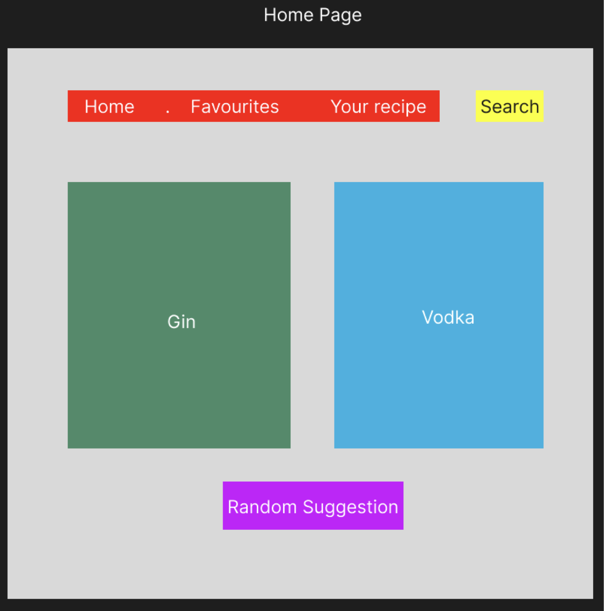

# API Choice

TheCocktailDB https://www.thecocktaildb.com/api.php

Intro

Introducing a dynamic frontend React application that serves as an encyclopedia for cocktail recipes, designed to elevate your mixology skills and enhance your cocktail experience. This user-friendly platform allows enthusiasts and novices alike to explore a vast collection of cocktail recipes, complete with detailed ingredient lists and precise measurements.
# User Stories

This website serves as a cocktail encyclopedia for users.

At the homepage, the website should have a navigation bar with links to Home, Favourites and Browse, as well as a search bar.
At the homepage, a random cocktail will be featured everytime user visits the homepage.
Users should be able to search for cocktails by name using the search bar, which will return a brief recipe on ingredients and measurement required.
Under favourites, there should be a component where users can save cocktail recipes as favourite.
Under browse, users will be able to see categories by main spirit type.

# Sample of API routes

Search by cocktail name: www.thecocktaildb.com/api/json/v1/1/search.php?s=margarita

Search by ingredient name: www.thecocktaildb.com/api/json/v1/1/search.php?i=vodka

Suggest a random cocktail: www.thecocktaildb.com/api/json/v1/1/random.php

# Wireframes

-Paired with react-router routes -Identify Components / state / fetch

HomePage - Consist of different categories ( By spirits ) -> like a nav bar - One Button that says "SUGGEST A DRINK!" / "DRINK OF THE DAY" - Search name button - Favourite button - Create your own recipe?

Existing libraries / css

Identify Data to CUD

Favourited drinks

# Initial User Interface

# Issues with netlify
https://answers.netlify.com/t/support-guide-i-ve-deployed-my-site-but-i-still-see-page-not-found/125?utm_source=404page&utm_campaign=community_tracking
